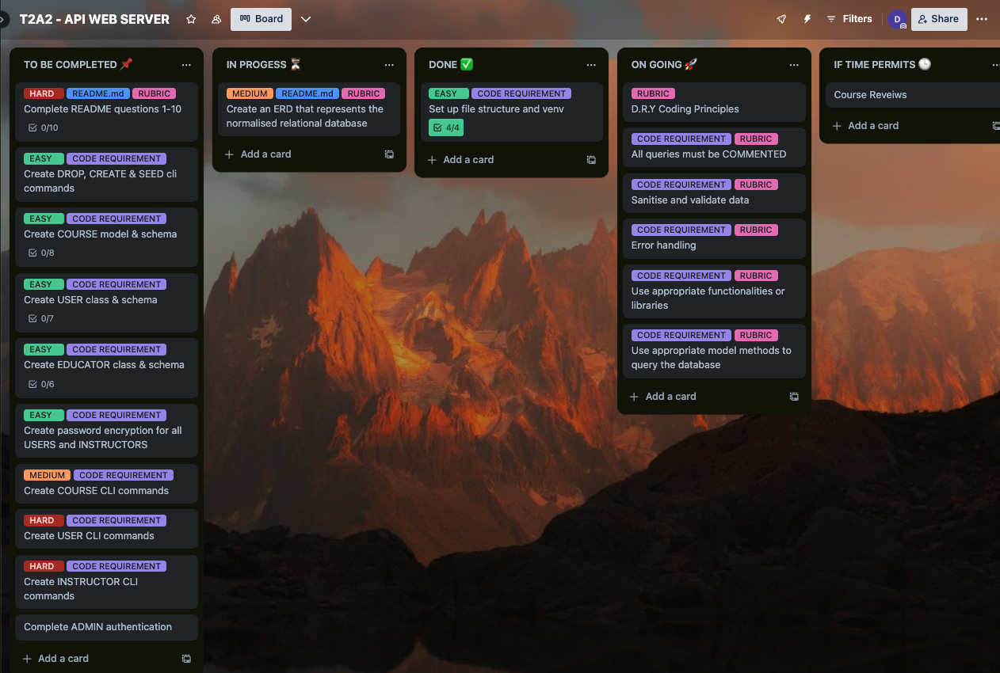

# T2A2 - API Webserver Project

# Table of Contents:
### [Github Repository](#github-repository)
### [R1 Identification of the problem you are trying to solve by building this particular app](#r1-identification-of-the-problem-you-are-trying-to-solve-by-building-this-particular-app)
### [R2 Why is it a problem that needs solving?](#r2-why-is-it-a-problem-that-needs-solving)
### [R3 Why have you chosen this database system. What are the drawbacks compared to others?](#r3-why-have-you-chosen-this-database-system-what-are-the-drawbacks-compared-to-others)
### [R4 Identify and discuss the key functionalities and benefits of an ORM](#r4-identify-and-discuss-the-key-functionalities-and-benefits-of-an-orm)
### [R5 Document all endpoints for your API](#r5-document-all-endpoints-for-your-api)
### [R6 An ERD for your app](#r6-an-erd-for-your-app)
### [R7 Detail any third party services that your app will use](#r7-detail-any-third-party-services-that-your-app-will-use)
### [R8 Describe your projects models in terms of the relationships they have with each other](#r8-describe-your-projects-models-in-terms-of-the-relationships-they-have-with-each-other)
### [R9 Discuss the database relations to be implemented in your application](#r9-discuss-the-database-relations-to-be-implemented-in-your-application)
### [R10 Describe the way tasks are allocated and tracked in your project](#r10-describe-the-way-tasks-are-allocated-and-tracked-in-your-project)


## GitHub Repository
The link for the API Webserver Project GitHub repository can be found [here](https://github.com/derdriu-mcateer/DerdriuMcAteer_T2A2)


## R1 Identification of the problem you are trying to solve by building this particular app.
The problem that this app is addressing is the issue of limited access to quality education relating to personal development. Limited accessibility to quality educational resources significantly impedes individuals from unlocking their full potential, acquiring new skills, or fostering personal growth.

## R2 Why is it a problem that needs solving?
Unfortunately, many individuals worldwide lack access to quality personal development courses due to financial and social limitations. While several online learning platforms exist, many quality ones often come with a price tag, limiting accessibility for those with financial constraints. Furthermore, even among the available free resources, there might be limitations in the scope and depth of content, catering only to specific niches or lacking comprehensive coverage across various personal development domains. By developing an API that provides a diverse array of free personal development courses, it can empower individuals and contribute to a more informed and skilled global population. 

By creating this API it will allow seamless access to educational content, enabling individuals from various locations, especially those in underserved or remote areas, to connect to the platform and access high-quality learning materials. An API-driven approach enables continuous improvements and additions to the platform. It allows for scalability, ensuring that as the platform grows, it can accommodate more users and offer new courses or features.

## R3 Why have you chosen this database system. What are the drawbacks compared to others?
The chosen database management system for this project is PostgreSQL. PostgreSQL is an advanced object-relational database management system which conforms to SQL, it  emphasises flexibility, innovation, adaptability and compatibility. (Juba et al., 2019)

Utilising PostgreSQL in developing a flask-based API for creating an online learning environment offers many advantages. One of PostgreSQL's pivotal advantages is its adherence to ACID principles—Atomicity, Consistency, Isolation, and Durability. PostgreSQL's reliability and ACID compliance in comparison to other DBMS such as Oracle, ensures the reliability of transactions and maintains data integrity, guaranteeing a valid and consistent state even in the face of errors or hardware failures.(Boltic, n.d.)  Moreover, PostgreSQL achieves optimal performance through both vertical and horizontal scalability. This scalability empowers PostgreSQL to effortlessly handle increased transaction volumes and larger data sets. (Dhruv, 2019)

Another key advantage is PostgreSQL’s open-source model, ensuring continuous support, security updates and comprehensive documentation. This model has allowed developers to identify and fix issues within PostgreSQL as well as allowing developers to propose new features. This has ensured that PostgreSQL remains current with the technology industry and best practices.(Juba & Volkov, 2019)

Furthermore, PostgreSQL's compatibility with Flask, a Python-based web framework, ensures a smooth integration process for developing the API. Flask's simplicity combined with PostgreSQL's reliability offers a potent combination for building a scalable, secure, and high-performing API that effectively caters to the needs of an online learning environment. (Gori, 2020)

In comparison to other DBMSs, such as MySQL or Oracle, a drawback of PostgreSQL is its complexity.  Its richness in functionalities, such as support for complex data types and extensibility through user-defined functions and procedural languages, can contribute to a steeper learning curve. (Boltic, n.d.) PostgreSQL’s focus on providing a wide array of features for diverse use cases might require a deeper understanding of database concepts and more intricate configurations compared to simpler and more specialised databases, making it relatively more complex for beginners or projects with straightforward requirements. (Boltic, n.d.)

Aside from its complexity, PostgreSQL's drawbacks lie in potential resource intensiveness, where it might consume more system resources than lighter databases, impacting performance, especially on systems with limited resources.(Juba et al., 2019) Additionally, while PostgreSQL has a strong community, it may be less frequently used compared to other database systems, potentially leading to a scarcity of readily available expertise or fewer online resources for troubleshooting specific issues. (Dhruv, 2019) These factors could slightly impede its adoption or support, especially in environments where immediate expert assistance or widespread familiarity is crucial.

In summary, PostgreSQL offers reliability, scalability, and compatibility for developing a robust Flask-based API. Its adherence to ACID principles ensures data integrity, while its open-source nature fosters continuous support and innovation. Yet, PostgreSQL's complexity and resource demands might pose challenges for beginners or in environments lacking immediate expertise. Despite these considerations, as an API handling personal development courses, the emphasis on data accuracy, consistency, and scalability aligns with PostgreSQL's strengths, making it an ideal choice for ensuring a robust and scalable platform catering to the varied educational needs of users seeking personal development opportunities.

## R4 Identify and discuss the key functionalities and benefits of an ORM
Object Relational Mapping (ORM) is a programming technique that facilitates the conversion between data stored in databases and the object-oriented programming (OOP) language. (Abba, 2022) For example, SQLAlchemy is an ORM tool which enables seamless interactions between Python applications and databases, achieving this by translating Python classes into corresponding tables within the relational database structure and converting function calls into SQL statements. (Krebs, 2017)

### Key Functionalities of ORM
#### Object Mapping: 
ORM simplifies the connection between object-oriented programming structures (classes, objects) and relational database tables, allowing developers to seamlessly handle data using familiar OOP approaches while effortlessly storing it in a database. This process involves defining classes that reflect the database's tables, where class attributes typically match table columns, and methods encapsulate data manipulation or access logic.(Liang, 2021)
#### Relationship Management: 
ORM has capability of handling associations or connections between different data entities within a relational database. These associations often include various types such as one-to-one, one-to-many, and many-to-many relationships, each representing different ways in which data entities relate to each other. ORM frameworks provide mechanisms to establish and navigate these relationships using object-oriented principles. Developers can define these relationships within their models or classes, specifying how different entities are connected or linked. These relationships are then translated into appropriate database structures, such as foreign keys or intermediary tables, by the ORM framework.(Kanade, 2023)
#### CRUD Operations Simplification:
ORM simplifies CRUD operations by providing easy-to-use, object-oriented methods that abstract the underlying SQL queries. This abstraction shields developers from the complexities of SQL syntax, allowing them to focus on application logic and data manipulation using familiar object-oriented programming methods.(Kanade, 2023)

|  |  |
| ----------- | ----------- |
| Create | ORM streamlines the creation of new database records by providing methods that allow developers to instantiate new objects, set their attributes, and persist them to the database. For example, in Python's SQLAlchemy, creating a new object representing a database record and adding it to the session can be as simple as creating an instance of a mapped class and using the session's add() method. (Rathore, 2023) |
| Read | Retrieving data from the database becomes more intuitive with ORM. Instead of writing complex SQL queries, developers can use methods provided by the ORM framework to fetch records based on specific criteria, retrieve single or multiple objects, or even navigate relationships between objects. This simplifies querying by using object-oriented interfaces, making it easier to fetch data without directly dealing with SQL syntax.(Kanade, 2023) |
| Update | ORM frameworks often offer methods to modify existing database records effortlessly. Developers can manipulate object attributes directly, and upon committing changes, the ORM handles the necessary SQL statements to update the corresponding records in the database. This approach allows for a more natural way of updating data, as developers work with objects similar to regular programming objects. (Rathore, 2023) |
| Delete | ORM frameworks provide methods to remove objects from the database, deleting corresponding records. By simply calling a method or function within the framework, developers can delete objects without explicitly crafting SQL delete statements, enhancing the simplicity and readability of the code.(Kanade, 2023) |

### Key Benefits of ORM

**Figure 4.1 demonstrates some of the key benefits that ORM offers.**

#### Productivity: 
By abstracting database operations, developers save time and effort, steering clear of writing repetitive code and managing database connections. This translates into heightened productivity, quicker development cycles, and more robust software. (Liang, 2021)
#### Code complexity: 
ORM abstracts away intricate SQL operations, simplifying code structures and maintenance by utilising high-level programming constructs instead of direct database manipulations.(Kanade, 2023)
#### Code reusability: 
ORM decouples application logic from specific databases, allowing the same codebase to seamlessly function across various database systems, reducing redundancy and fostering modular code design.(Liang, 2021)
#### Security: 
ORM systems come equipped with built-in security measures, safeguarding against common vulnerabilities like SQL injection by automating input sanitization and enabling fine-grained access controls.(Kanade, 2023)
Performance: ORM optimises data retrieval and access by minimising database calls, utilising caching mechanisms, and generating efficient SQL statements, thereby enhancing application performance and reducing latency.(Kanade, 2023)

## R5 Document all endpoints for your API

## 1. /login 🟧 POST 

- Parses the required data of "email" and "password" from the incoming JSON
- Retrieves the corresponding user/educator from the database based on the provided email.
- Validates the entered password against the stored hashed password 
- If the credentials match, generates a JWT token for the user/educator with the id (for users) and email (for educators) as the identity and a specific expiration time.
- Responds with a success message, user/educator details, and the generated token in JSON format `200`

 .png)
 .png)

## 2. /users/register 🟧 POST
- Loads the required new user information for registering from the incoming JSON request ("email", "name", "password", "d_o_b"(optional), "phone_number")
- Creates a new instance of an user with the loaded information, including hashing the password securely using bcrypt.
- Adds new user instance to the database session.
- Commits the session with the new user instance to the database.
- Returns the newly created user's information in JSON format(excluding the password) `201`

 

## 3. /users 🟩 GET
- Checks for a valid JWT token for access
- Validates that only users with admin privileges can access this endpoint
- Returns all users' profiles (excluding password) within the database in JSON format `200`


 

## 4. /users/<user.id> 🟩 GET
- Checks for a valid JWT token for access
- Validates that only an admin or the user themselves can access this endpoint.
- Checks that user ID provided in route is a valid user in the database, if not found returns an error message `404`
- If user ID is valid, returns the user's profile (excluding password) in JSON format `200`

 

## 5. /users/update/<user.id> 🟦 PUT / PATCH
- Checks for a valid JWT token for access
- Validates if the user updating the user's information is either an admin or the user themselves.
- Loads the user information for updating from the incoming JSON request 
  - the JSON can include "email", "name", "password", "d_o_b" or "phone_number"
- Checks if the user id passed in the route is a valid user within the database, if not found an error message is returned `404`
- If the user id is valid:
  - Updates user information such as email, name, phone number and DOB based on the provided fields in the request
  - If a new password is provided in the request, it hashes the password and updated it, only if the user updating the password is the user associated with the account. If user is not authorised to update the password an error message is returned `403`
- Changes are commited to the database 
- Returns the updated user's information in JSON format (excluding password) `200`

 

## 6. /users/update_admin/<user.id> 🟦 PUT / PATCH
- Checks for a valid JWT token for access
- Validates that only users with admin privileges can access this endpoint 
- Checks if the user id passed in the route is a valid user within the database, if not found an error message is returned `404`
- If the user id is valid:
  - Checks if "is_admin" has been passed in the JSON information, returns error message if field is missing `400`
  - Updates the user's admin status to reflect the boolean value provided in the JSON information
  - commits the changes to the database
- Returns with the updates user's informagtion in JSON format `200`
 

## 7. /users/<user.id> 🟥 DELETE
- Checks for a valid JWT token for access
- Verifies the user's authorisation (either an admin or the user themselves)
- Retrieves the user information based on the provided id, if no user exists returns an error `404`
- If the user is found then the user's profile is deleted from the database
- The changes are commits to the database and reutrns a success message indicating the user instance has been deleted `200`
 

## 8. /educators/register 🟧 POST
- Checks for a valid JWT token for access
- Validates that only users with admin privileges can access this endpoint
- Loads the required new educator information for registering from the incoming JSON request ("email", "name", "password", "d_o_b"(optional), "phone_number")
- Creates a new instance of an Educator with the loaded information, including hashing the password securely using bcrypt.
- Adds new Educator instance to the database session.
- Commits the session with the new Educator instance to the database.
- Returns the newly created Educator's information in JSON format(excluding the password) `201`
 

## 9. /educators 🟩 GET
- Checks for a valid JWT token for access
- Validates that only users with admin privileges can access this endpoint
- Returns all educators' profiles within the database in JSON format `200`
 

## 10. /educators/<educator.id> 🟩 GET
- Checks for a valid JWT token for access
- Validates that only users with admin privileges can access this endpoint 
- Checks that educator ID provided in route is a valid educator in the database, if not found returns an error message `404`
- If Educator ID is valid, returns the educator's profile in JSON format `200`
 

## 11. /educators/update/<educator.id> 🟦 PUT / PATCH
- Checks for a valid JWT token for access
- Validates if the user updating the educator information is either an admin or the educator themselves.
- Loads the educator information for updating from the incoming JSON request 
    - the JSON can include "email", "name", "password", "d_o_b" or "phone_number"
- Checks if the educator id passed in the route is a valid educator within the database, if not found an error message is returned `404`
- If the educator id is valid:
  - Updates educator information such as email, name, phone number and DOB based on the provided fields in the request
  - If a new password is provided in the request, it hashes the password and updated it, only if the user updating the password is the educator associated with the account. If user is not authorised to update the password an error message is returned `403`
- Changes are commited to the database 
- Returns the updated educator information in JSON format (excluding password) `200`

 

## 12. /educators/<educator.id> 🟥 DELETE
- Checks for a valid JWT token for access
- Validates that only users with admin privileges can access this endpoint.
- Retrieves the Educator information based on the provided id, if no educator exists returns an error `404`
- If the educator is found then the educator's profile is deleted from the database
- The changes are commits to the database and reutrns a success message indicating the Educator instance has been deleted `200`

 

## 13. /courses 🟧 POST
- Checks for a valid JWT token for access
- Validates that only users with admin privileges can access this endpoint 
- Loads the new course's information from the incoming JSON request ("title", "date", "description, "duration", "capacity")
- Validates the existence of an educator by checking the provided educator_id in the request. If an educator_id is provided and it does not correspond to a valid educator, it returns an error. `400`
- Creates a new course instance using the loaded course information.
- Associates an educator with the course based on the educator_id.
- Adds the new course to the database
- Changes are commited to the database 
- Returns the details of the created course in JSON format `201`

 .png)

## 14. /courses 🟩 GET
- Checks for a valid JWT token for access
- Returns all course information for all courses within the database in JSON format `200`

 

## 15. /courses/<course.id> 🟩 GET
- Checks for a valid JWT token for access
- Checks that course id provided in route is a valid course in the database, if not found returns an error message `404`
- If course id is valid, returns the course information in JSON format `200`

 

## 16. /courses/update/<course.id> 🟦 PUT / PATCH
- Checks for a valid JWT token for access
- Validates that only users with admin privileges can access this endpoint.
- Loads the course information for updating from the incoming JSON request 
- Checks if the course exists bases on the provided id from the route, if not found then returns an error message `404`
- If the course exists the verious fields of the course are updated if the fields are provided in the JSON request
    - the JSON can include "title", "date", "description", "duration", "capacity", "educator_id"
- If an educator is provided in the JSON, the educator ID is checked for validity, if invalid then an error message is returned `400`
- Changes are committed to the datavase 
- Retruns the updated course information in JSON format `200`

 

## 17. /courses/<course.id> 🟥 DELETE
- Checks for a valid JWT token for access
- Validates that only users with admin privileges can access this endpoint.
- Retrieves the course information based on the provided id, if no course exists returns an error `404`
- If the course is found then it is deleted from the database
- The changes are commits to the database and reutrns a success message indicating the course has been deleted `200`

 .png)

## 18. /courses/<course.id>/reviews 🟧 POST
- Checks for a valid JWT token for access
- Loads the review information ("description") from the incoming JSON request.
- Creates a new review object with the provided description, user_id from the JWT token, and course_id from the endpoint parameter
- Adds the new review to the database 
- Returns the new revies  in JSON format `201`
- If an educator attempts to create a review, returns an error message `403`

 

## 19. /courses/<course.id>/reviews/<review.id> 🟦 PUT / PATCH
- Checks for a valid JWT token for access
- Loads the review information for updating ("description") from the incoming JSON request.
- Checks if the review exists based on the provided 'review_id' in the route, if no review exists returns an error message `404` 
- If the review exists then validates if the user updating the review is either an admin or the user who created the review.
- Updates the review's description to the description provided in the request 
- Commits the changes to the database
- Returns the updated review information in JSON format `200`

 

## 20. /courses/<course.id>/reviews/<review.id> 🟥 DELETE
- Checks for a valid JWT token for access
- Verifies the user's authorisation (either an admin or the user themselves).
- Checks if the review.id exists. If not, returns error message `404`
- If the review exists, it is deleted from the database
- Returns with a success message indicating that the review has been deleted `200`

 .png)

## 21. /users/<user.id>/enrolments/<course.id> 🟧 POST
- Checks for a valid JWT token for access
- Verifies the user's authorisation (either an admin or the user themselves).
- Checks if the user and the course exist. If not, returns error messages. `404`
- Checks if a current enrollment exists with the same user id and course id combination, if found returns an error message `400`
- Checks if the course has enough capacity for another enrolment, if not returns an error message `400`
- If all checks are successful then a new instance of the enrolment is create 
- Responds with a success message indicating that the user has been enrolled into the course `201`

 


## 22. /users/<user.id>/enrolments/<course.id>  🟥 DELETE
- Checks for a valid JWT token for access
- Verifies the user's authorisation (either an admin or the user themselves).
- Checks if the user and the course exist. If not, returns error messages.`404`
- Finds the enrollment record for the specific user and course.
- If the enrollment exists, it is deleted from the database.
- Responds with a success message indicating that the user has been unenrolled from the course if the deletion is successful. `200`

 .png)

## R6 An ERD for your app


## R7 Detail any third party services that your app will use
|  |  |
| ----------- | ----------- |
| **PostgreSQL** | PostgreSQL is an open-source relational database management system. (Nemesis, 2023) |
| **SQLAlchemy** | SQLAlchemy is a Python-based SQL toolkit and Object-Relational Mapping (ORM) library (Nemesis, 2023) |
| **Falsk** | Flask is a micro web framework written in Python. (PythonBasics, 2021) Flask applications user SQLAlchemy, to interact with databases. SQLAlchemy abstracts database operations, allowing users to work with databases using Python objects rather than raw SQL queries.|
| **Marshmallow** | Marshmallow is a Python library that allows serialization and deserialization of complex data types, facilitating the conversion of Python objects into JSON and vice versa.  (Rahman, 2020)|
| **Psycopg2** | Psycopg2 is a PostgreSQL adapter for Python allowing Python applications to communicate with PostgreSQL databases. It enables Python code to interact, query, and manage PostgreSQL databases by translating Python commands into PostgreSQL's native SQL language. (PythonBasics, 2021) |
| **Bcrypt** | Bcrypt is a cryptographic hashing function primarily used for securely hashing passwords. It is used within the cli blueprint to hash the stored password for the users and educators instances. It is also used within the educator and user blueprints to hash the password for newly registered users/educators.     |
| **JWT Manager** | JWTManager is an extension that simplifies the handling of JSON Web Tokens (JWTs) within Flask applications. With the auth blueprint the create_access_token() token is used to generate an access token for a specified user identity. Throughout the project jwt_required() is used to protect routes, ensuring that access is only granted to requests containing valid access tokens. Get_jwt_identity() is also frequenly used in the blueprints to retrieves the identity (eg. ID or email) from the current access token. This function is often used to get the identity of the authenticated user.   |
|


## R8 Describe your projects models in terms of the relationships they have with each other
### User Model

The user model represents a user of the application. It has two relationships, a ONE to MANY relationship with Enrolments where one user can have many enrolments but one enrolment can only have one user. The second relationship is a ONE to MANY with the Review model where one user can have many reviews but each review can only be associated with one user.  
```python
class User(db.Model):

    __tablename__ = "users"
    
    id = db.Column(db.Integer, primary_key=True)
    email = db.Column(db.String(), nullable=False, unique=True)
    password = db.Column(db.String(), nullable=False)
    name = db.Column(db.String, nullable=False)
    d_o_b = db.Column(db.Date, default="N/A")
    phone_number = db.Column(db.String(), nullable=False)
    is_admin = db.Column(db.Boolean(), default=False)
    
    enrolments = db.relationship("Enrolment", back_populates="user", cascade="all, delete")

    reviews = db.relationship("Review", back_populates="user", cascade="all, delete")
```

| Code | Description |
| ----------- | ----------- |
| id = db.Column(db.Integer, primary_key=True) | This attribute serves as the primary key, uniquely identifying each user within the database. It's an auto-incrementing integer.  |
| email = db.Column(db.String(), nullable=False, unique=True) | A unique string field which is not optional |
| password = db.Column(db.String(), nullable=False) | This fields stores the user's password  |
| name = db.Column(db.String, nullable=False) | A required string which store's the user's name. |
| d_o_b = db.Column(db.Date, default="N/A") | This date represents the user's data of birth - not a mandatory field and will default to N/A if not provided |
| phone_number = db.Column(db.String(), nullable=False) | This string store's the user's phone number. It is a mandatory field  |
| is_admin = db.Column(db.Boolean(), default=False) | A boolean fields indicating whether the user has admin privileges. |
| enrolments = db.relationship("Enrolment", back_populates="user", cascade="all, delete") | The user model has a enrolments attribute which connects it to the Enrolment model. The User model employs `back_populates` to reference the corresponding relationship within the Enrolment model. This model also users `cascade ="all, delete"` to manage cascading deletions.  |
| reviews = db.relationship("Review", back_populates="user", cascade="all, delete") |  The reviews attribute provides a link between the User model and the Review model. This model uses `back_populates` to refer to the corresponding relationship in the Review model. It also utilises `cascade ="all, delete"` is used to handle cascading deletions.  |


### Course Model
The course model represents a course within the application. The course model has a ONE TO MANY relationship with the Educator model. Where an educator can have multiple courses but a course can only have a single educator.The course model has a ONE TO MANY relationship with the Enrolment model The course model has a ONE TO MANY relationship with the Review model

```python
class Course(db.Model):
    __tablename__= "courses"
    
    id = db.Column(db.Integer, primary_key=True)
    title = db.Column(db.String(), nullable=False)
    date = db.Column(db.Date, default=datetime.now().strftime('%Y-%m-%d'))
    description = db.Column(db.String(), nullable=False)
    duration = db.Column(db.String(), nullable=False)
    capacity = db.Column(db.Integer, default=10)

    educator_id = db.Column(db.Integer, db.ForeignKey("educators.id"),nullable=False)
    educator = db.relationship("Educator", back_populates="courses")

    enrolments = db.relationship("Enrolment", back_populates="course", cascade="all, delete")

    reviews = db.relationship("Review", back_populates="course", cascade="all, delete")
```
| Code | Description |
| ----------- | ----------- |
| id = db.Column(db.Integer, primary_key=True) | This attribute serves as the primary key, uniquely identifying each course within the database. It's an auto-incrementing integer.  |
| title = db.Column(db.String(), nullable=False) | A required string which stores the title of the course |
| date = db.Column(db.Date, default=datetime.now().strftime('%Y-%m-%d')) | A date field which represents the date the course will be held. It will default to the date the course is created as deafult |
| description = db.Column(db.String(), nullable=False) | The field stores a description of the course, it is a mandatory attribute |
| duration = db.Column(db.String(), nullable=False) | A required string which represents the duration of the course |
| capacity = db.Column(db.Integer, default=10) | This integer represents the number of enrolments a course can have. It will default to 10 if not provided |
| educator_id = db.Column(db.Integer, db.ForeignKey("educators.id"),nullable=False) | The course model creates a column labled educator_id which represents a foreign key constraint that references the id column within the educators table. |
| educator = db.relationship("Educator", back_populates="courses") | The educator attribute defines the relationship between the Course model and the Educator model. It allows access to the an educator object associated with a course and is set up to work in conjunction with the `back_populates` parameter in the Educator model. |
| enrolments = db.relationship("Enrolment", back_populates="course", cascade="all, delete") | This attribute specifies that a course can have multiple enrolments. It allows access to an enrolment object associated with a course and is set up to work in conjunction with the `back_populates` paramtered in the Enrolment model. The cascade="all, delete" parameter means that when a course is deleted, all associated enrolments will also be deleted (ensuring referential integrity). |
| reviews = db.relationship("Review", back_populates="course", cascade="all, delete") | This attribute denotes that a course can have multiple reviews associated with it. This model uses `back_populates` to refer to the corresponding relationship in the Review model. Similarly to the above relationship, the `cascade ="all, delete"` parameter ensures that when a course is deleted, all linked reviews will also be deleted.  |


### Educator Model
The educator model represents the educator who will teach the course within the application. The Educator model has a ONE TO MANY relationship with Course model , where an educator can have multiple courses but each course can only have one educator.
```python
class Educator(db.Model):
    __tablename__ = "educators"
    
    id = db.Column(db.Integer, primary_key=True)
    email = db.Column(db.String(), nullable=False, unique=True)
    password = db.Column(db.String(), nullable=False)
    name = db.Column(db.String, nullable=False)
    d_o_b = db.Column(db.Date, default="N/A")
    phone_number = db.Column(db.String(), nullable=False, unique=True)
    
    courses = db.relationship("Course", back_populates="educator")
```

| Code | Description |
| ----------- | ----------- |
| id = db.Column(db.Integer, primary_key=True) | This attribute serves as the primary key, uniquely identifying each educator within the database. It's an auto-incrementing integer. |
| email = db.Column(db.String(), nullable=False, unique=True) | A unique string field which is not optional |
| password = db.Column(db.String(), nullable=False) | This fields stores the educator's password  |
| name = db.Column(db.String, nullable=False) | A required string which store's the educator's name. |
| d_o_b = db.Column(db.Date, default="N/A") | This date represents the educator's data of birth - not a mandatory field and will default to N/A if not provided |
| phone_number = db.Column(db.String(), nullable=False, unique=True) | This string store's the educator's phone number. It is a mandatory field  |
| courses = db.relationship("Course", back_populates="educator") | The `back_populates` argument allows the Educator model to establish a bidirectional relationship with the Course model. It ensures a connection between the two models by specifying the corresponding attribute in the Course model that represents the inverse side of this relationship. |


### Enrolment Model
The enrolment model represents a user's enrollment into a course within the applicatin. The Enrolment model has a ONE TO MANY relationship with the User model, where an enrolment can have one user but a user can have multiple enrolments.
```python
class Enrolment(db.Model):
    __tablename__ = 'enrolments'

    id = db.Column(db.Integer, primary_key=True)

    user_id = db.Column(db.Integer, db.ForeignKey('users.id'))
    user = db.relationship('User', back_populates='enrolments')

    course_id = db.Column(db.Integer, db.ForeignKey('courses.id'))
    course = db.relationship('Course', back_populates='enrolments')
```

| Code  | Description |
| ---------- | ----------- |
| id = db.Column(db.Integer, primary_key=True)  | This attribute serves as the primary key, uniquely identifying each enrolment within the database. It's an auto-incrementing integer. |
| user_id = db.Column(db.Integer, db.ForeignKey('users.id')) |The user_id in the Enrolment model is a foreign key that references the id column in the users table.  |
| user = db.relationship('User', back_populates='enrolments') | Each Enrolment object has an associated User object, and this relationship can be accessed via the user attribute in the Enrolment model. The `back_populates` argument defines the relationship from the Enrolment side back to the User model. |
| course_id = db.Column(db.Integer, db.ForeignKey('courses.id')) | The enrolment model creates a column labled course_id which represents a foreign key constraint that references the id column within the courses table. |
| course = db.relationship('Course', back_populates='enrolments') | Each Enrolment object has an associated Course object, and this relationship can be accessed via the course attribute in the Enrolment model. The `back_populates` argument defines the relationship from the Enrolment side back to the Course model. |


### Review Model
The review model represents a user's reviews of a course within the applicatin. It has two relationships; it has a ONE to MANY relationship with User where a user can have many reivews but a review can only have one user associated with it. This model also has a ONE to MANY relationship with the Course model where a course can have many reivews but a review can only be associated with one course. 

```python
class Review(db.Model):
    __tablename__= "reviews"
    
    id = db.Column(db.Integer, primary_key=True)
    description = db.Column(db.String(250), nullable=False)
 
    user_id = db.Column(db.Integer, db.ForeignKey("users.id"), nullable=False)
    user = db.relationship("User", back_populates="reviews")

    course_id = db.Column(db.Integer, db.ForeignKey("courses.id"),nullable=False)
    course = db.relationship("Course", back_populates="reviews")
```

| Code | Description |
| ----------- | ----------- |
| id = db.Column(db.Integer, primary_key=True) | This attribute serves as the primary key, uniquely identifying each review within the database. It's an auto-incrementing integer. |
| description = db.Column(db.String(250), nullable=False) | This string field stores a description which represents the review message, it is a mandatory attribute |
| user_id = db.Column(db.Integer, db.ForeignKey("users.id"), nullable=False) | The review model creates a column labled user_id which represents a foreign key constraint that references the id column within the users table. |
| user = db.relationship("User", back_populates="reviews") | Each Review object has an associated User object, and this relationship can be accessed via the user attribute. The `back_populates` argument defines the relationship from the Review side back to the User model. |
| course_id = db.Column(db.Integer, db.ForeignKey("courses.id"),nullable=False) | The review model creates a column labled course_id which represents a foreign key constraint that references the id column within the courses table. |
| course = db.relationship("Course", back_populates="reviews") | Each Review object has an associated Course object, and this relationship can be accessed via the course attribute in the Review model. The `back_populates` argument defines the relationship from the Review side back to the Course model. |

## R9 Discuss the database relations to be implemented in your application
### Users
Below is an example of a populated users table as represented in PostgreSQL. 


A user within the database is represented through the users relation. Each user has a unique user id that serves as the primary key in defining a user, while linking the user table to both the enrolments and reviews tables, where the user id serves as a foreign key. The user relation has numerous columns and are as follows: A name section which identifies the users name, date_of_birth to store the users birth date and age of the user, email is the users provided email address, password is the user provided password linked to their user id, phone number is the user's contact phone number and an admin boolean represents whether a particular user is an administrator or not.

### Courses

Below is an example of a populated courses table as represented in PostgreSQL.  


The courses offered through the online platform are represented through the courses table, uses the course_id as it's primary key to uniquely identify each course. This identifies connects various columns within the table, holding essential details about each course. Additionally, it serves as a foreign key, linking to both the reviews and enrolments table.The columns within the courses table are:the vourse's title, a description elaborating on the course content, dates indicating its occurence, a duration specifying hwo long the course will run for, capacity which determins student enrolment and an educator id refereing the instructor of the course. The educator id also serves as a foreing key linking to the educators table. 

### Educators

Below is an example of a populated educators table as represented in PostgreSQL.


An educator within the database is outlined in the educators table, where a unique educator ID serves as the primary key and acts as a foreign key when uses within the courses table. This identifier connects to several colummns detailing educator information, including the educator's name, date of birth, email, password and phone number. 

### Enrolments 

Below is an example of a populated enrolments table as represented in PostgreSQL.


A user's enrolment into a course is represented through the enrolments table. The enrolment table serves as a joining table in order to link a particular user ID to a course ID and “join” them under a singular enrolment ID that serves as the primary key within this table.

### Reviews 

Below is an example of a populated reviews table as represented in PostgreSQL.


A user's review of a course is represnted through the reviews table. The review table consists of a review, identified by a unique review ID, which serves as the primary key. A specific user, identified by user id, is able to select a course they have undertaken, identified by course id, and provide a description of their experience of the course. As such, the table consists of a user id, course id and description to make up a review.


## R10 Describe the way tasks are allocated and tracked in your project

For this project I used Trello as my project management tool to help me allocate and track tasks. I chose to use Trello because it's flexibility allows me to adapt my project management approach to fit various methodologies, and customize boards, lists, and cards to suit the unique needs of my project.

My board consisted of 5 categoies:
- TO BE COMPLETED 📌
  -  This category includes tasks that are yet to be started
- IN PROGRESS ⏳
  - This category is for tasks that are in the process of being completed
- DONE ✅
  - This category is for tasks that have been successfully completed
- ON GOING 🚀
  - This category is for tasks/ideas that need to be constantly considered 
- IF TIME PERMITS  🕒
  - This category is for tasks that would be great to execute but are not vital to the final product 

Individual tasks are represented by cards on the trello board. Each task has an appropriate title and description. And for some tasks/ideas I found it best to use checklists within certain cards to help break the tasks up into more manageable components. As well as this I utilised colour coded lables within the cards to help identify importance of certain tasks and to help recognise which tasks belonged to which aspects of the project. I found these labels extremely helpful in terms of time management as it allowed me to visually identify which tasks were most difficult. 

To view the trello board, please follow this [link](https://trello.com/b/Q8UNFyib/t2a2-api-web-server)

Below are `A FEW` progress screenshots during the development of the API application. The history of the board can be viewed within the trello website.




As well as Trello for porject management I used GitHub for version control and code management. With over 20 commits, GitHub facilitated efficient collaboration by maintaining version history and aiding in code organisation.  

